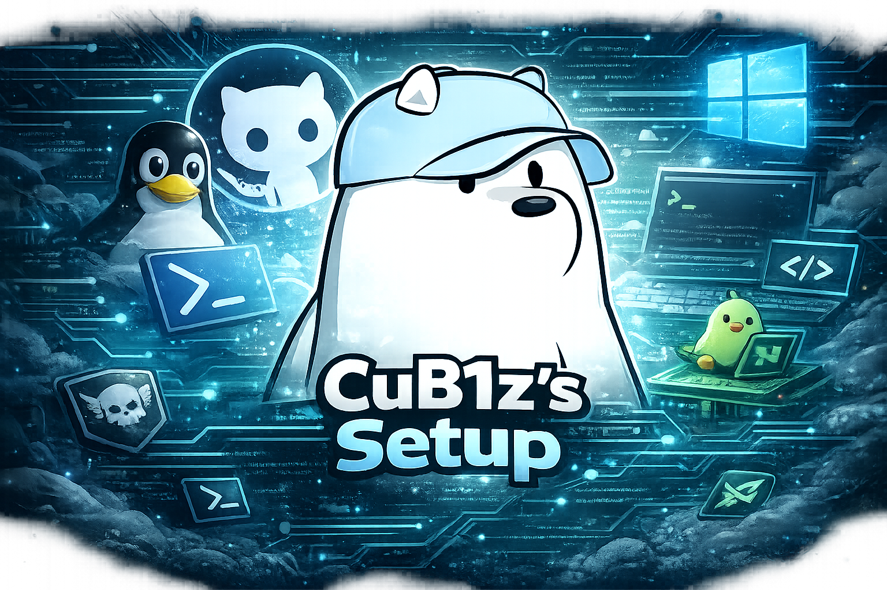

## Structure

```text
.
├── README.md
└── scripts/
    ├── ubuntu/
    │   └── setup.sh
    └── windows/
        └── setup.ps1
```

## Windows

Run PowerShell as Administrator:

```powershell
cd scripts/windows
.\setup.ps1
```

Remote version:

```powershell
irm https://raw.githubusercontent.com/CuB1z/setup/main/scripts/windows/setup.ps1 | iex
```

Includes:
- Windows Update
- App installation and upgrades via winget
- Gaming tweaks (power plan, GameDVR/Game Mode, HAGS, mouse acceleration off, power throttling off, CPU priority tuning, etc.)
- GPU detection with NVIDIA/AMD/Intel software install
- Bloatware and startup app cleanup
- Managed policy for Brave extensions

## Ubuntu

```bash
bash scripts/ubuntu/setup.sh
```

Remote version:

```bash
curl -sL https://raw.githubusercontent.com/CuB1z/setup/main/scripts/ubuntu/setup.sh | bash
```

Includes:
- Base development tools
- FiraCode Nerd Font
- Brave + extension policy
- Docker + Compose
- VS Code + extensions + settings
- Postman, Spotify, Obsidian
- nvm (Node LTS), pyenv (Python), SDKMAN (Java)
- OpenCode
- Global Git configuration
- tmux configuration
- Managed block in `~/.bashrc` with aliases and functions (`new-ssh`, `update-all`)

## Useful Notes

- Brave bookmarks (Ubuntu): export/import manually from `brave://bookmarks`.
- After installing Docker on Ubuntu, restart your session to use `docker` without `sudo`.
- If SDKMAN does not install Java automatically:

```bash
sdk install java 21.0.3-tem
```
